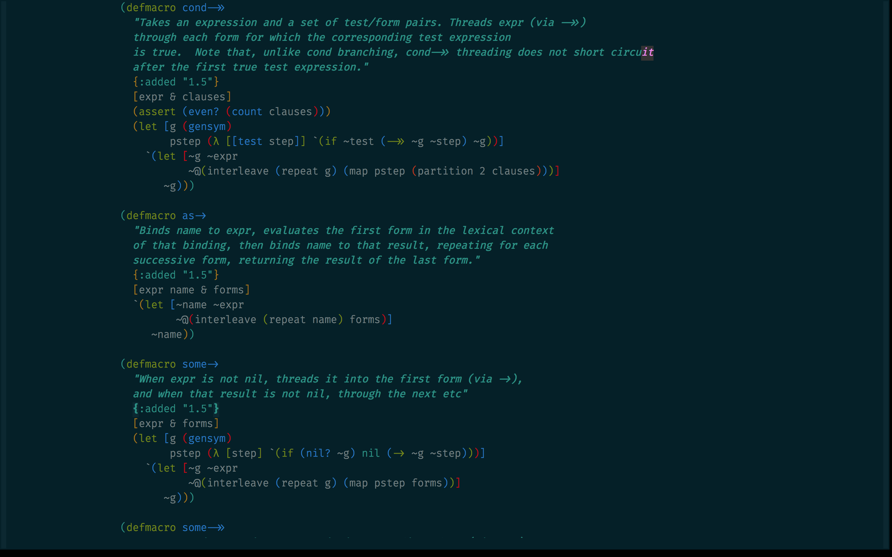

Dot Emacs
=========

My Emacs using config, optimized for web development in Clojure, Clojurescript, Javascript, HTML5, and CSS3/Less/Sass.

## Getting Started

Install the latest version of Emacs and symlink Emacs.app to `~/Applications`:

    brew install emacs --cocoa --srgb
    brew linkapps Emacs

Clone this repo (init.el), and start Emacs.

## Further Reading

Emacs can be daunting for beginners. Has always been. I'm learning Emacs the
hard-way and after a year and half, I'm not going back. 

You can find my cheatsheets and docs under the `wiki`.

I recommend [Magit](https://github.com/magit/magit), [Flycheck](http://www.flycheck.org), [FiraCode](https://github.com/tonsky/FiraCode),
and other outstanding plugins that you will come to enjoy from a growing community of Emacs hackers.

